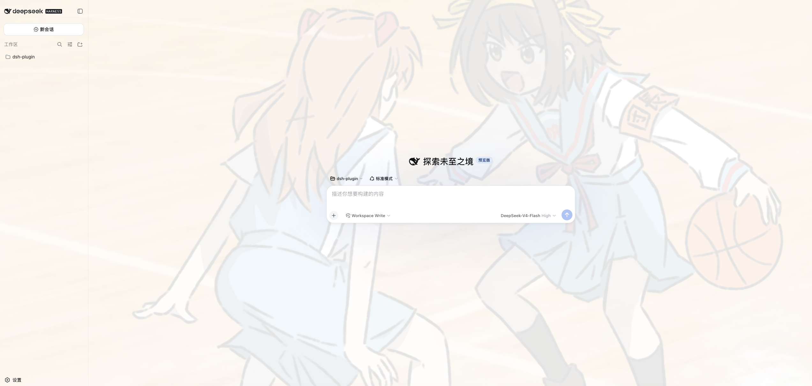

<h1 align="center">web-background</h1>

<p align="center"><strong>DeepSeek Harness web background settings plugin with solid color, image, and opacity controls.</strong></p>

<p align="center">
  
</p>

## 功能

- 在 **设置 → 通用 → 网页背景** 中切换：无、纯色、图片。
- 纯色模式支持颜色选择器。
- 图片模式使用本地上传图片（自动压缩为 data URL）。
- 支持 0–100% 背景不透明度。
- 设置保存在浏览器 `localStorage`，刷新后自动恢复。

## 安装

```sh
# git 源安装（构建产物入库）
dsh plugin --profile web add "github:lndyzwdxhs/web-background#main"

# 或本地目录
cd /path/to/web-background
pnpm install
pnpm run bundle
dsh plugin --profile web add .
```

如果本地 `dsh plugin add` 报 `ERR_PNPM_ADDING_TO_ROOT`，加 `-w`：

```sh
dsh plugin --profile web add -w .
```

如果本机没有全局 `dsh`，也可以用 `npx` 运行：

```sh
npx @deepseek-ai/dsh plugin --profile web add -w .
npx @deepseek-ai/dsh web
```

重启 web 生效。

## 开发

```sh
pnpm install
pnpm run bundle
pnpm run gates
pnpm run watch
```

- 客户端源码在 `src/client/index.ts`；构建后生成 `lib/client.js`。

## 架构

见 [docs/architecture.md](docs/architecture.md)。
